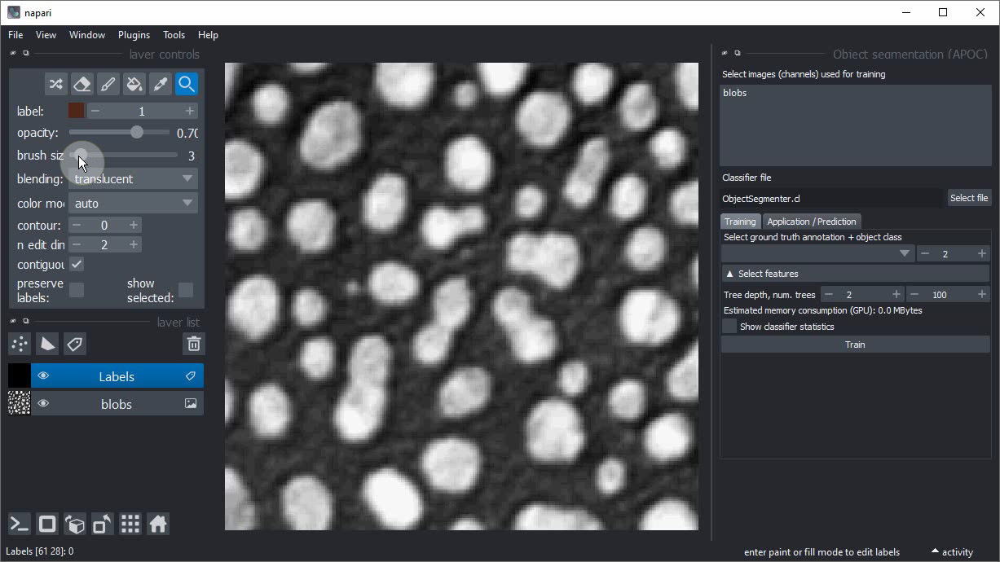
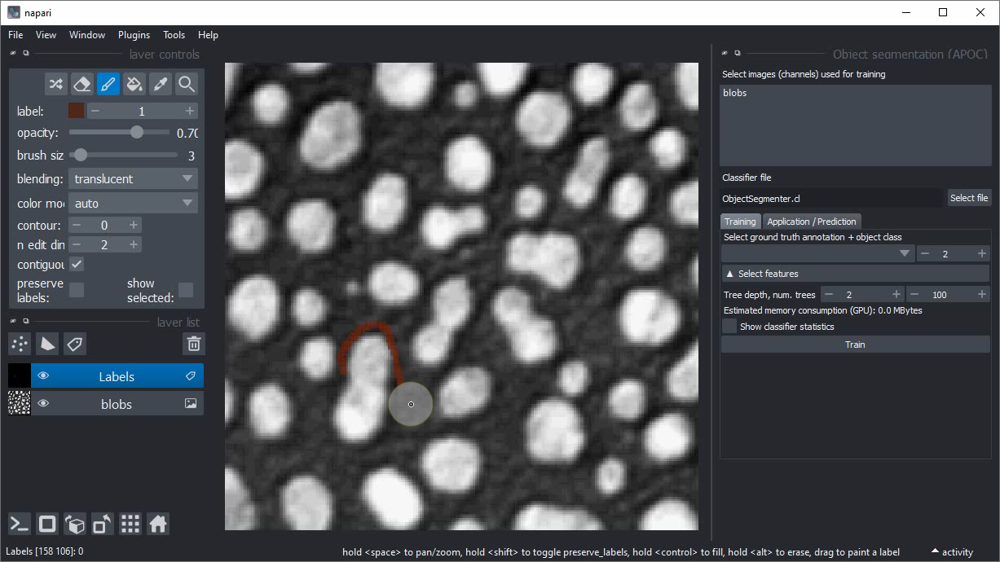
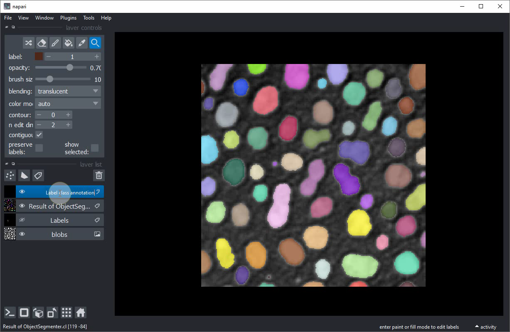
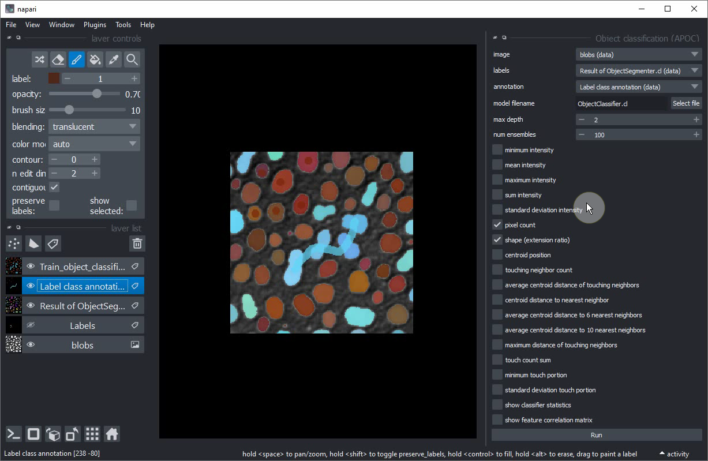

# Exercise: Interactive pixel and object classification

In this exercise we will train two [Random Forest Classifiers](https://en.wikipedia.org/wiki/Random_forest): 
one for pixel classification, and one for classifying segmented objects. 
We will use the napari plugins [napari-accelerated-pixel-and-object-classification](https://www.napari-hub.org/plugins/napari-accelerated-pixel-and-object-classification).

## Getting started

Open a terminal window and activate your conda environment:

```
conda activate devbio-napari-env
```

Afterwards, start up Napari:

```
napari
```

Load the "Blobs" example dataset from the menu `File > Open Sample > clEsperanto > Blobs (from ImageJ)`


## Pixel classification and Object Segmentation in Napari

For segmenting objects, we can use the Object Segmentation tool in APOC. Under the hood it uses a pixel classifier and [connected component labeling](https://en.wikipedia.org/wiki/Connected-component_labeling). 
The following procedure is also shown in [this video](apoc_object_segmentation.mp4).

<iframe src="https://github.com/BiAPoL/HIP_Introduction_to_Napari_and_image_processing_with_Python_2022/raw/main/docs/01_Introduction_BIA/apoc_object_classification.mp4" width=600></iframe>

Start the object segmentation from the `Tools > Segmentation / Labeling > Object Segmentation (APOC)` menu.


Add a new labels layer by clicking on this button:


Change the brush size to a small number such as 2 or 3.


Click on the `Paint brush` button.


Start annotating the `background` region where there is no object.


Increase the label that is drawn by one.


Draw an annotation within the objects of interest. Draw background and object annotation close by each other. The closer these two annotations are drawn, the smaller is the degree of freedom the computer has when optimizing the model later.


Within the `Object segmentation` user interface on the right, select the image/channel that should be processed.


Also select the annotation label image you have just drawn.


Click on `Train`. A label image should show up.


If the segmentation works well, consider backing up the `ObjectSegmenter.cl` file that has been saved. If you didn't change the file location before training, it will be located in the folder from where you started napari on the command line.

Close the `Object segmentation` user interface and hide or delete the `Labels` layer with your manual annotation.

## Object classification

Add another label image.


Rename the label image e.g. to `Label class annotation` to not mix it up with the other.


Activate the `Brush tool`.


Put small dots with label `1` into small roundish objects (for training purposes: really just the smaller ones).


Increase the `label` to `2`.


Draw a line throught the larger elongated objects in the center of the image.


Start the object classification tool from the menu `Tools > Segmentation post-processing > Object classification (APOC)`


In this user-interface, activate the `shape` checkbox.


Select `image`, `labels` and `annotation` like this:


Click on `Run`. After a second a new labels layer with brown / blue annotated objects should appear. Some larger round objects will be blue unintentionally.


Hide the newly created classification layer.


Select your annotation layer.


Annotate some more roundish objects, this time the larger ones.


Train the classifier again.


If you are happy with the trained classifier, copy the file to a safe place. When training the next classifier this one might be overwritten.

## Extra exercise
Retrain the classifier so that it can differentiate three differen classes:
* Small round objects
* Large round objects
* Large elongated objects
